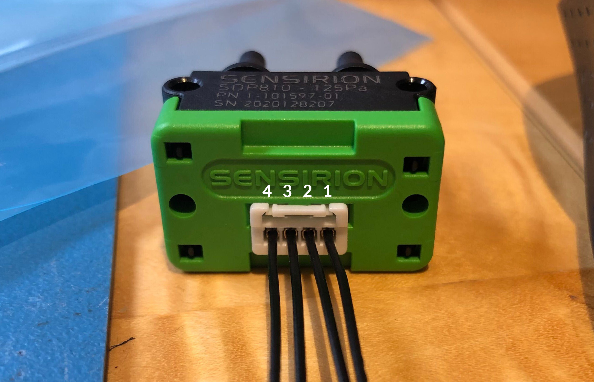
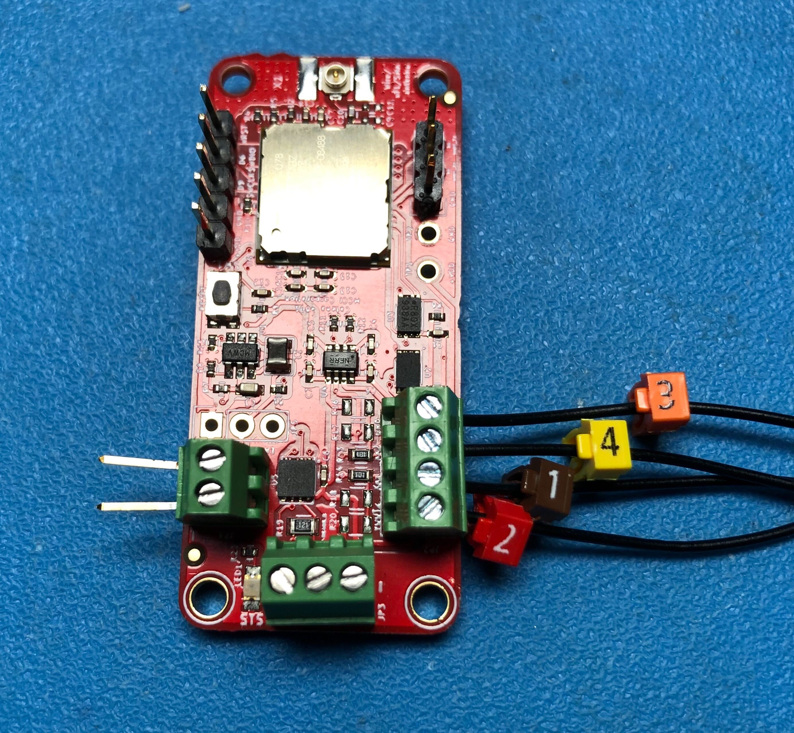

# MCCI Catena&reg; Arduino Library for Sensirion Differential Pressure Sensors

This library provides a simple interface to Sensirion SDP31, SDP32, and SDP800-family differential pressure sensors. Although we tested this on the MCCI Catena 4618, there are no dependencies on MCCI hardware; this should work equally well with Adafruit breakout boards, etc.

<!-- TOC depthFrom:2 updateOnSave:true -->

- [Installation](#installation)
	- [Installing Manually With Zip](#installing-manually-with-zip)
	- [Installing with the IDE](#installing-with-the-ide)
- [Using the Library](#using-the-library)
	- [Header file](#header-file)
	- [Namespaces](#namespaces)
	- [Declare Sensor Objects](#declare-sensor-objects)
	- [Preparing for use](#preparing-for-use)
	- [Setting measurement mode](#setting-measurement-mode)
	- [Start a measurement](#start-a-measurement)
	- [Poll results](#poll-results)
	- [Read measurement results](#read-measurement-results)
	- [Get most recent data](#get-most-recent-data)
	- [Put sensor to sleep](#put-sensor-to-sleep)
	- [Shutdown sensor (for external power down)](#shutdown-sensor-for-external-power-down)
- [Use with Catena 4801 M301](#use-with-catena-4801-m301)

<!-- /TOC -->

## Installation

### Installing Manually With Zip

- Download the latest ZIP version from the [release page](https://github.com/mcci-catena/MCCI_Catena_SDP/releases)
- Either unzip manually into your Arduino/Libraries directory, or use the IDE and select `Sketch > Include Library > Add .ZIP Library`.

### Installing with the IDE

- This library is published as an official Arduino library. So you can install from the IDE using `Sketch > Include Library > Manage Libraries...` to open the library manager, then search for `MCCI` and select this library from the list.

## Using the Library

### Header file

```c++
#include <MCCI_Catena_SDP.h>
```

### Namespaces

```c++
using namespace McciCatenaSdp;
```

### Declare Sensor Objects

```c++
// declare an instance of a sensor using TwoWire interface Wire,
// and the specified address. The known addresses are:
//    cSDP::Address::SDP3x_A (0x21, ADDR grounded)
//    cSDP::Address::SDP3x_B (0x22, ADDR to 1.2 kOhm resistor to ground)
//    cSDP::Address::SDP3x_C (0x23, ADDR to 2.7 kOhm resistor to ground)
//    cSDP::Address::SDP8xx  (0x25, only supported address)
// The default for the interface is &Wire, and the default i2c_address is SDP3x_A.

cSDP mySdp(&Wire, i2c_address);
```

You need to declare one `cSDP` instance for each sensor.

### Preparing for use

Use the `begin()` method to prepare for use.

```c++
bool cSDP::begin();
```

It returns `true` for success, `false` for failure.

### Setting measurement mode

The mode can be set by the following commands:

```c++
// cSDP::Mode::DifferentialPressure is the default
// cSDP::Mode::MassFlow selects mass flow optimized measurements.
bool cSDP::setMode(cSDP::Mode mode);
cSDP::Mode cSDP::getMode() const;
```

### Start a measurement

```c++
bool cSDP::startTriggeredMeasurement();
```

### Poll results

```c++
bool cSDP::queryReady();
```

To be really safe, if this returns `false` when using this to exit a busy loop, you should check the last error code. If it's not `cSDP::Error::Busy`, then a measurement is not in progress, and the loop will never ext.

### Read measurement results

```c++
bool cSDP::readMeasurmeent();
```

This succeeds only if `queryReady()` has returned true. It reads the measurement from the sensor and returns `true` if all is successful. CRCs are checked.

If it fails, the last data is unchanged.

### Get most recent data

```c++
float cSDP::getTemperature() const;
float cSDP::getDifferentialPressure() const;
// return Measurement::Temperature and Measurement::DifferentialPressure:
cSDP::Measurement getMeasurement() const;
```

### Put sensor to sleep

```c++
bool cSDP::sleep();
```

### Shutdown sensor (for external power down)

You must call `cSDP::begin()` before using the sensor again.

```c++
void cSDP::end();
```

## Use with Catena 4801 M301

The Catena 4801 M301 is a modified Catena 4801, with I2C brought to JP2 (and a LPWAN radio, of course).

The configuration looks like this:

   | 4801 Pin |  Label | SDP Pin     | Cable Tag Color
   |:--------:|:------:|:-----------:|---------------
   |   JP2-1  |  +VDD  |      2      | Red
   |   JP2-2  |   SCL  |      1      | Brown
   |   JP2-3  |   SDA  |      4      | Yellow
   |   JP2-4  |   GND  |      3      | Orange

The cable on the SDP810-125Pa attaches like this:



The wires of the cable assembly should be connected to JP2 of the 4801 M301. Note the interleaving.



